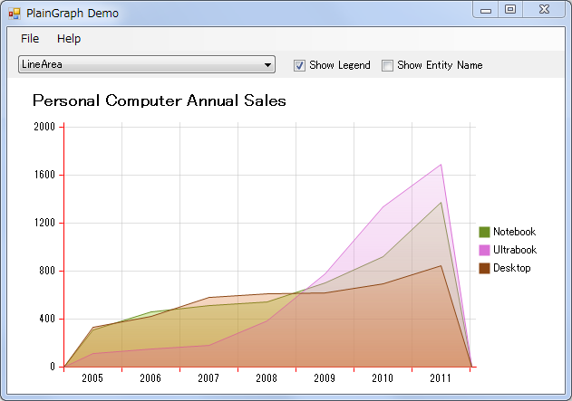
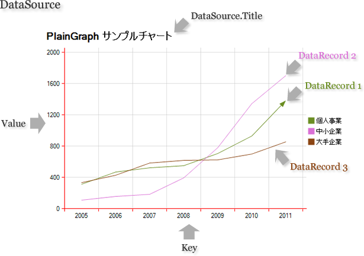

PlainGraph
==========

A fast and lightweight .NET chart control. Supports 7 types of chart by using one unified data source.

 - Line
 - LinePoint
 - LineArea
 - Column
 - Stacked Column
 - Stacked Percent Column
 - Pie

# Snapshots

See [source code](Src/PlainGraphDemo/DemoForm.cs)

# Usage

Chats are created from a data source.

The data source contains the data serials, title and labels. All you need is preparing your data source and simply specify it for the graph.

# License

This software is released under MIT license.

Copyright (c) Jingwood, unvell.com 2012-2015, All rights reserved.
